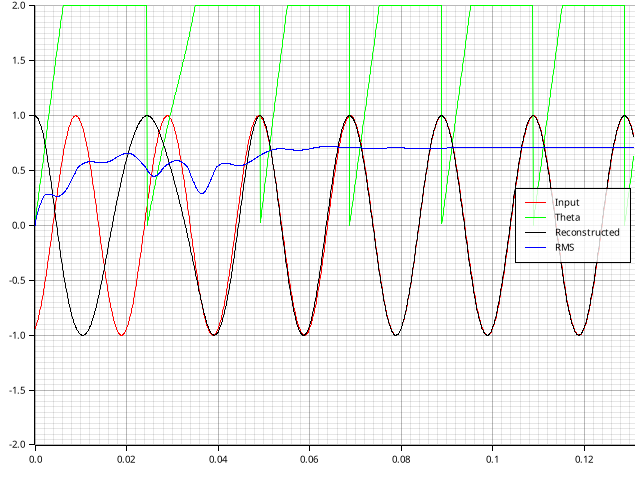
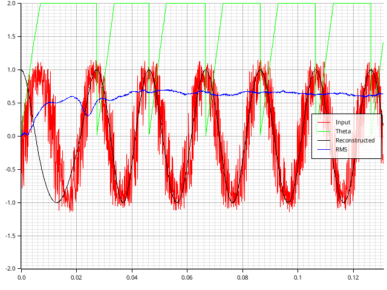

# SOGI-PLL

---

---

## Demo

### Pure Sine Wave

### Distorted Sine Wave

---

You can find the code used to generate these images in the [examples](https://github.com/Orange-Murker/sogi_pll/tree/main/examples) folder.
